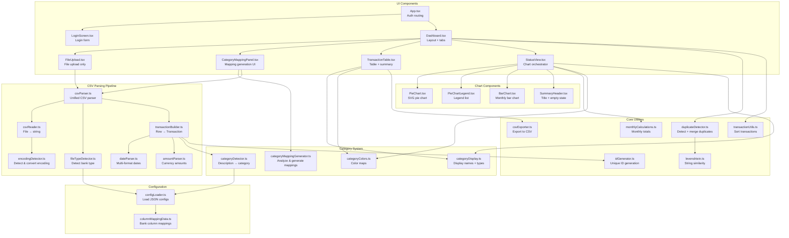
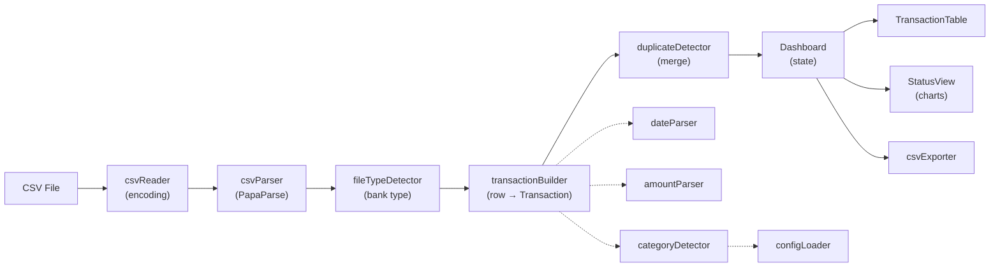

# Architecture

## Module Structure

```mermaid
graph TD
    subgraph UI["UI Components"]
        App["App.tsx<br/>Auth routing"]
        Login["LoginScreen.tsx<br/>Login form"]
        Dash["Dashboard.tsx<br/>Layout + tabs"]
        FU["FileUpload.tsx<br/>File upload only"]
        CMP["CategoryMappingPanel.tsx<br/>Mapping generation UI"]
        TT["TransactionTable.tsx<br/>Table + summary"]
        SV["StatusView.tsx<br/>Chart orchestrator"]
    end

    subgraph Charts["Chart Components"]
        PC["PieChart.tsx<br/>SVG pie chart"]
        PCL["PieChartLegend.tsx<br/>Legend list"]
        BC["BarChart.tsx<br/>Monthly bar chart"]
        SH["SummaryHeader.tsx<br/>Title + empty state"]
    end

    subgraph Parsing["CSV Parsing Pipeline"]
        ED["encodingDetector.ts<br/>Detect & convert encoding"]
        CR["csvReader.ts<br/>File → string"]
        CP["csvParser.ts<br/>Unified CSV parser"]
        FTD["fileTypeDetector.ts<br/>Detect bank type"]
        DP["dateParser.ts<br/>Multi-format dates"]
        AP["amountParser.ts<br/>Currency amounts"]
        TB["transactionBuilder.ts<br/>Row → Transaction"]
    end

    subgraph Category["Category System"]
        CD["categoryDetector.ts<br/>Description → category"]
        CC["categoryColors.ts<br/>Color maps"]
        CDis["categoryDisplay.ts<br/>Display names + types"]
        CMG["categoryMappingGenerator.ts<br/>Analyze & generate mappings"]
    end

    subgraph Config["Configuration"]
        CL["configLoader.ts<br/>Load JSON configs"]
        CMD["columnMappingData.ts<br/>Bank column mappings"]
    end

    subgraph CoreUtils["Core Utilities"]
        DD["duplicateDetector.ts<br/>Detect + merge duplicates"]
        LV["levenshtein.ts<br/>String similarity"]
        TU["transactionUtils.ts<br/>Sort transactions"]
        MC["monthlyCalculations.ts<br/>Monthly totals"]
        EX["csvExporter.ts<br/>Export to CSV"]
        IG["idGenerator.ts<br/>Unique ID generation"]
    end

    App --> Login
    App --> Dash
    Dash --> FU
    Dash --> CMP
    Dash --> TT
    Dash --> SV
    SV --> PC
    SV --> PCL
    SV --> BC
    SV --> SH

    FU --> CP
    CP --> CR
    CR --> ED
    CP --> FTD
    CP --> TB
    TB --> DP
    TB --> AP
    TB --> CD
    TB --> IG
    FTD --> CL
    CD --> CL

    Dash --> DD
    DD --> LV
    Dash --> TU
    TT --> CDis
    TT --> CC
    SV --> MC
    SV --> CC
    SV --> CDis
    TT --> EX

    CMP --> CMG
    CMP --> CP

    CL --> CMD
```

## Data Flow

```mermaid
flowchart LR
    A["CSV File"] --> B["csvReader<br/>(encoding)"]
    B --> C["csvParser<br/>(PapaParse)"]
    C --> D["fileTypeDetector<br/>(bank type)"]
    D --> E["transactionBuilder<br/>(row → Transaction)"]
    E --> F["duplicateDetector<br/>(merge)"]
    F --> G["Dashboard<br/>(state)"]
    G --> H["TransactionTable"]
    G --> I["StatusView<br/>(charts)"]
    G --> J["csvExporter"]

    E -.-> K["dateParser"]
    E -.-> L["amountParser"]
    E -.-> M["categoryDetector"]
    M -.-> N["configLoader"]
```
